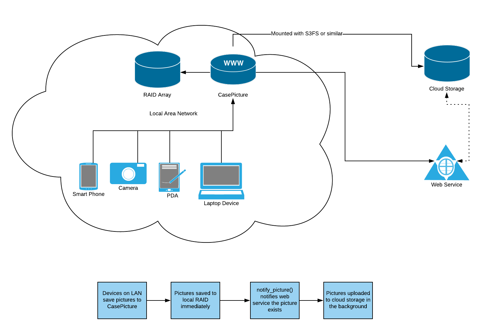

# CasePicture

Industrial photography made easy.

CasePicture is a simple tool for capturing a high volume of photographs and keeping them organized by subject matter.

- Any device with a camera and WiFi can be used to take pictures
  - Including smart phones, tablets, and PCs with webcams
- Pictures are named after subject matter and date taken
- Pictures are stored in a central file repository
- Pictures can be searched by subject and date in seconds
- Pictures can be easily synced with remote cloud storage

## Installation: Basic

1. Unpack CasePicture on any webserver with PHP
2. Copy config.php.dist to config.php, and customize any settings as needed.
   1. Default settings should be fine for most cases.
   2. Make sure:
      1. $saveFolder is writable by the webserver
      2. $localUploadDir is writable by the webserver
      3. For the "download zip" functionality, you will need the PHP Zip extension enabled
3. Start taking pictures.

## Fast Mobile Switching QR Code

In some environments it may be useful to switch from the screen on a computer to a handheld
device like a phone.

To do this, make sure to run composer install to bring in the necessary libraries. Once
done, you will see a QR code in the bottom left of the main application. Scanning it will
quickly take a phone or other device to the picture tool.

## Considerations

CasePicture is intended to be used as an appliance on a LAN. Ideally, it should be installed on a system with some kind of redundant storage and a fast local connection. That way, there is little or no lag in saving high-quality pictures and videos.

If you plan to use CasePicture on a public-facing server you may want to password protect it using .htaccess or a similar method.

### Remote File Shares / Cloud Storage

An ideal deployment may look like this:

In the above diagram, CasePicture is installed on a local server with a RAID array.

1. Edit your config:
   1. $saveFolder should point to the local storage / RAID array
   2. $localUploadDir should point to a local mountpoint for the cloud storage. For example, an Amazon S3 bucket mounted using [S3FS](https://github.com/s3fs-fuse/s3fs-fuse)
   3. $urlBase should point to the wwwroot where a file uploaded to cloud storage can be accessed
2. Create notify_picture()
   1. Define a notify_picture() function which takes the following arguments:
      1. filename of a picture
      2. prefix used when taking the picture
      3. optional second identifier
      4. URL where file can be accessed publicly (ie. $urlBase + name of the file)
   2. notify_picture() should notify your web service that the picture exists, using a webhook, api-call, or similar.

### Security

CasePicture is intended to be used on a controlled local area network, so it doesn't include any kind of access control. However, you are free to add whatever access controls you like.

### PHP Configuration

You'll probably need to tweak your php.ini settings, specifically upload_max_filesize and post_max_size.

### Known Issues

1. CasePicture relies on [webcam.js](https://github.com/jhuckaby/webcamjs) , which is in maintenance mode at the time of writing. It's very likely webcam.js will no longer work after December 2018. Plans are to migrate to [jpeg_camera](https://github.com/amw/jpeg_camera)

## Dependencies / Attributions

1. PHP Zip extension for zipfile download/export
2. [webcam.js](https://github.com/jhuckaby/webcamjs), created by Joseph Huckaby
3. [jquery.tablesorter.min.js](https://plugins.jquery.com/tablesorter/), created by Christian Bach
4. Bootstrap 3.x
